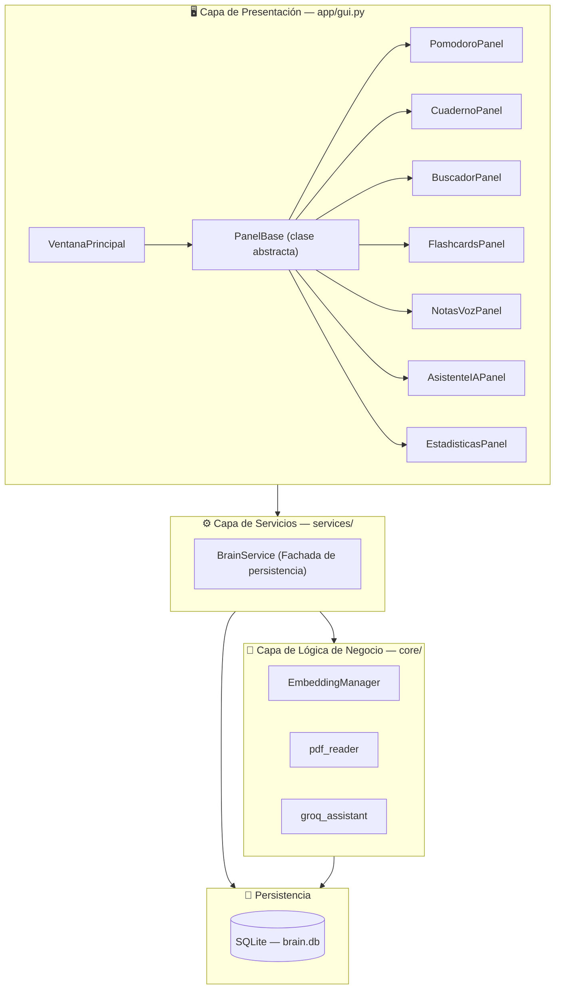
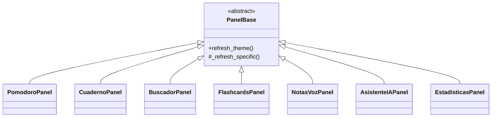

<div align="center">

# 🧠 NeuroCore AI

### *Second Brain App* — Gestión de conocimiento personal potenciada por IA

Proyecto final del curso de **Programación Orientada a Objetos**


</div>

---

## 📋 Tabla de contenidos

- [Descripción general](#-descripción-general)
- [Características principales](#-características-principales)
- [Arquitectura del sistema](#️-arquitectura-del-sistema)
- [Principios y patrones de POO aplicados](#-principios-y-patrones-de-poo-aplicados)
- [Tecnologías utilizadas](#️-tecnologías-utilizadas)
- [Estructura del proyecto](#-estructura-del-proyecto)
- [Modelo de datos](#️-modelo-de-datos)
- [Instalación y ejecución](#-instalación-y-ejecución)
- [Configuración de la IA](#-configuración-de-la-ia-groq-api)
- [Notas de seguridad](#-notas-de-seguridad)
- [Roadmap](#️-roadmap--mejoras-futuras)
- [Contexto académico](#-contexto-académico)
- [Licencia](#-licencia)

---

## 📖 Descripción general

**NeuroCore AI** es una aplicación de escritorio tipo *"segundo cerebro"* que centraliza el flujo de estudio de un estudiante: tomar apuntes, organizarlos por curso y tema, generar flashcards con repaso espaciado, buscar información por significado (no solo por palabras clave), transcribir notas de voz y conversar con un asistente de IA con acceso a búsqueda web.

El proyecto fue diseñado explícitamente para demostrar una **arquitectura por capas** y la aplicación práctica de **principios de Programación Orientada a Objetos** (herencia, encapsulamiento, polimorfismo y patrones de diseño), más allá de ser solo una herramienta funcional.

```
GUI (PyQt6)  →  Services (BrainService)  →  Core (IA, embeddings, PDFs)  →  Persistencia (SQLite)
```

---

## ✨ Características principales

| Módulo | Descripción |
|---|---|
| ⏱️ **Enfoque (Pomodoro)** | Temporizador de concentración y descanso, con historial de sesiones guardado en base de datos. |
| 📓 **Cuaderno** | Editor de texto enriquecido para apuntes, organizados por curso y tema. Permite ingestar PDFs completos, que se dividen automáticamente en párrafos/apuntes. |
| 🔍 **Buscador inteligente** | Búsqueda semántica: encuentra apuntes por el *significado* de la consulta, no por coincidencia exacta de palabras, usando *embeddings* vectoriales. |
| 🃏 **Flashcards** | Sistema de repaso espaciado (intervalo se duplica en cada acierto y se reinicia en cada fallo), organizado por curso y tema. |
| 🎙️ **Notas de voz** | Grabación de audio y transcripción automática a texto mediante IA (Whisper), lista para guardarse como apunte. |
| 💬 **Asistente IA** | Chat con un modelo de lenguaje (Groq) que puede complementar sus respuestas con resultados de búsqueda web en tiempo real. |
| 📊 **Estadísticas** | Panel visual con gráficos de barras propios (dibujados con `QPainter`) sobre el progreso y tiempo de estudio. |
| 🌗 **Modo claro / oscuro** | Sistema de theming centralizado, aplicado de forma consistente a todos los paneles. |

---

## 🏗️ Arquitectura del sistema

La aplicación sigue una **arquitectura en capas**, donde cada capa solo conoce a la inmediatamente inferior:



### Jerarquía de paneles (herencia)

Los 7 paneles de navegación heredan de una misma clase base, que define el comportamiento común de theming:



---

## 🧩 Principios y patrones de POO aplicados

| Patrón / principio | Dónde se aplica | Propósito |
|---|---|---|
| **Método Plantilla** (*Template Method*) | `PanelBase.refresh_theme()` define el algoritmo común y delega el paso específico en `_refresh_specific()`, que cada uno de los 7 paneles sobrescribe. | Evitar duplicar la lógica de refresco de tema en cada panel. |
| **Fachada** (*Facade*) | `BrainService` | Expone una API simple (crear apunte, guardar flashcard, buscar, etc.) y oculta el SQL crudo y el esquema de la base de datos al resto de la app. |
| **Worker / Observer** (señales y slots de Qt) | `PDFIngestWorker`, `WhisperWorker`, `GrabacionWorker`, `AIWorker` (subclases de `QThread`/`QObject`) | Ejecutar tareas pesadas (leer PDFs, transcribir audio, llamar a la API de IA) en segundo plano sin congelar la interfaz, notificando a la GUI mediante señales. |
| **Estrategia con *fallback*** | Búsqueda en `BuscadorPanel` / `EmbeddingManager` | Si `sentence-transformers` no está instalado, la búsqueda semántica cae automáticamente a búsqueda por texto plano, sin romper la app. |
| **Encapsulamiento** | `app/config.py` | Centraliza rutas de datos y configuración sensible, aislando esos detalles del resto del código. |
| **Instancia única** (estilo *Singleton*) | `_app = QApplication.instance() or QApplication(sys.argv)` en `gui.py` | Garantiza una sola instancia de la aplicación Qt en toda la ejecución. |
| **Composición de widgets** | `Card`, `SectionHeader`, `NavButton`, `RingWidget`, `BarChartWidget` | Componentes reutilizables construidos sobre `QWidget`/`QFrame`, en vez de duplicar estilos y layouts. |

---

## 🛠️ Tecnologías utilizadas

| Categoría | Tecnología |
|---|---|
| Lenguaje | Python 3.10+ |
| Interfaz gráfica | PyQt6 (estilo inspirado en Material Design 3) |
| Persistencia | SQLite3 (acceso directo, sin ORM) |
| Búsqueda semántica | `sentence-transformers` (`paraphrase-multilingual-MiniLM-L12-v2`) |
| Lectura de PDFs | `pdfplumber` |
| Transcripción de voz | `openai-whisper` (modelo `small`) |
| Grabación de audio | `sounddevice` + `soundfile` |
| Asistente de IA | Groq API (`llama-3.3-70b-versatile`) |
| Búsqueda web del asistente | Scraper propio sobre DuckDuckGo HTML, vía `requests` |

---

## 📂 Estructura del proyecto

```
Second-Brain-App/
├── app/
│   ├── __init__.py
│   ├── config.py        # Rutas de datos y configuración (API keys)
│   ├── gui.py            # Toda la interfaz: ventana principal + 7 paneles
│   └── main.py           # Punto de entrada de la aplicación
├── core/
│   ├── __init__.py
│   ├── embeddings.py      # Búsqueda semántica (sentence-transformers)
│   ├── groq_assistant.py  # Asistente de IA + scraper de búsqueda web
│   └── pdf_reader.py      # Extracción y segmentación de texto de PDFs
├── services/
│   ├── __init__.py
│   └── brain_service.py   # Fachada de persistencia (SQLite)
├── data/
│   └── brain.db           # Base de datos local (se genera automáticamente)
├── tests/
│   └── __init__.py
├── requirements.txt
└── README.md
```

---

## 🗄️ Modelo de datos

La base de datos SQLite (`data/brain.db`) se crea e inicializa automáticamente en el primer arranque, con las siguientes tablas:

| Tabla | Propósito |
|---|---|
| `apuntes` | Notas del cuaderno, con su categoría, texto y *embedding* vectorial. |
| `cursos` | Cursos creados por el usuario para organizar apuntes y flashcards. |
| `temas` | Temas dentro de cada curso (relación 1:N con `cursos`). |
| `flashcards` | Preguntas/respuestas con `intervalo_dias` y `proxima_revision` para el repaso espaciado. |
| `pomodoro_temp` / `descanso_temp` | Configuración temporal de duración de sesiones. |
| `sesiones_concentracion` | Historial de sesiones de estudio (usado en el panel de Estadísticas). |

---

## 🚀 Instalación y ejecución

### Requisitos previos
- Python 3.10 o superior
- pip

### Pasos

```bash
# 1. Clonar el repositorio
git clone https://github.com/<tu-usuario>/<tu-repositorio>.git
cd <tu-repositorio>

# 2. Crear y activar un entorno virtual (recomendado)
python -m venv venv
venv\Scripts\activate        # Windows
source venv/bin/activate     # macOS / Linux

# 3. Instalar dependencias
pip install -r requirements.txt

# 4. Ejecutar la aplicación
python app/main.py
```

La primera vez que se ejecuta, la aplicación crea automáticamente la carpeta `data/` y el archivo `brain.db`.

---

## 🔑 Configuración de la IA (Groq API)

El **Asistente IA** requiere una clave de Groq (gratuita) para funcionar:

1. Crear una cuenta y generar una clave en [console.groq.com/keys](https://console.groq.com/keys).
2. Configurarla como variable de entorno antes de ejecutar la app:

```bash
export GROQ_API_KEY="tu_clave_aquí"      # macOS / Linux
setx GROQ_API_KEY "tu_clave_aquí"        # Windows
```

Si no se configura ninguna clave, el resto de la aplicación sigue funcionando con normalidad; solo el panel de Asistente IA quedará deshabilitado.

---

## 🗺️ Roadmap / mejoras futuras

- [ ] Retirar la clave de API hardcodeada de `config.py`
- [ ] Agregar pruebas automatizadas (la carpeta `tests/` ya está preparada)
- [ ] Exportar apuntes y flashcards (PDF / Markdown)
- [ ] Sincronización opcional en la nube

---

## 🎓 Contexto académico

| Campo | Detalle |
|---|---|
| Curso | Programación Orientada a Objetos |
| Universidad | `[Nombre de tu universidad]` |
| Autor | `[Tu nombre completo]` |
| Docente | `[Nombre del profesor]` |
| Periodo académico | `[Ciclo / semestre]` |

---

## 📄 Licencia

Proyecto desarrollado con fines académicos. Puedes adaptarlo a la licencia que prefieras (por ejemplo, [MIT](https://choosealicense.com/licenses/mit/)) antes de publicarlo.
